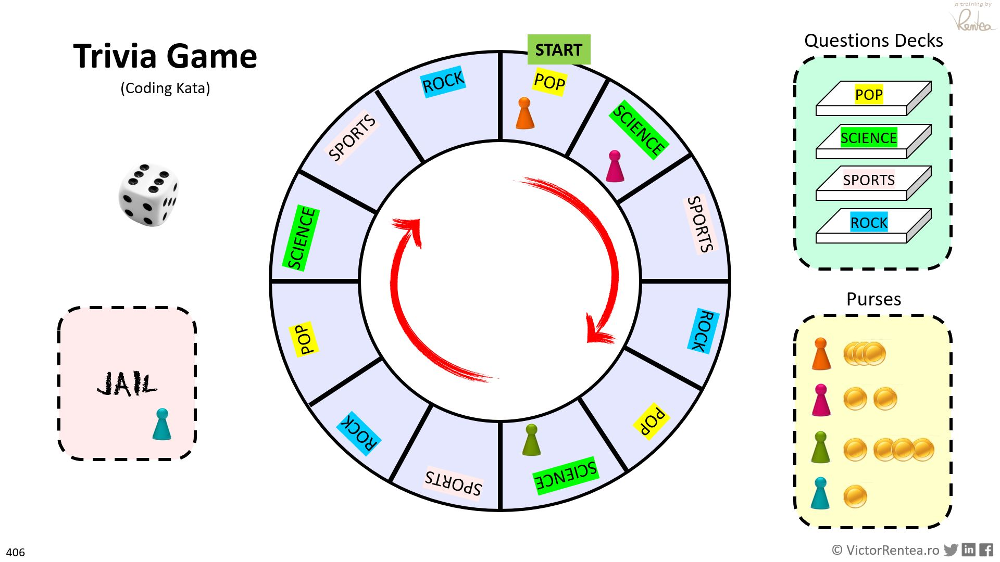

# Trivia Refactoring Kata
Arranged by Victor Rentea

(Just one of the many coding katas at [kata-log.rocks](https://kata-log.rocks/))

## The problem
Here is a preview of a game in action.

Each turn a player: rolls the dice and has to answer to a question from the deck corresponding to its current position. If the answer is correct [s]he gets coins. If incorrect, [s]he is sent to the prison. The board has 12 positions.

You should discover more the details from actual code, just like in real-life. Good luck!

Additionally, you could run the PlayGame.main() to actually play the game to get the feeling.

## Let there be tests!
Once upon a time, there was an ugly implementation of the Trivia Game.

Someone once noticed that as long as the same input is provided to the system, 
it will print the same output at the console. So that guy then had the idea to 
Copy-Paste the old implementation (to GameBetter.java), and write a test
that using a LOT of random inputs would call both the old system and the NEW system with the same inputs.
Many-many times. 10.000 times. And then the test would then just verify that the console output 
remained the same despite your refactorings.

This is called the "Golden Master Method", and it was used to build GameTest. 

## The Task
Your job is to refactor GameBetter.java, continuously running GameTest to make sure you don't break anything.

⚠️ Try to avoid over-engineering: Keep It Short and Simple (💋KISS Principle)

**Do not touch Game.java** unless to fix a bug.

Goal: apply Object-Oriented Principles, Identify Responsibilities (SRP), remove duplication (DRY principle), and other good software practices! 

Warnings:
- Some names are misleading.
- There are missing abstractions (classes).
- There is a typo and a bug hidden in there. Can you find it? If you do, fix it in the old code too (Game.java).

Do you best until you're *proud* of this code!

## Expected Working Time: 2-4 hours
For Best Experience:
- Ideally work in Pair Programming
- You will need a min of 3-4 passes through code
- Re-read each class until there's **nothing** to improve

## Technique
- Try to use as much quickfix as possible: Alt-Enter/⌥Enter (IntelliJ) or Ctrl-1 (Eclipse) 
- Use as much automatic IDE refactoring as possible
- Work in small steps, continuously running tests
- Commit frequently such that you made a mistake or took a wrong turn, you can revert to safety. 
- Never be afraid to Revert and explore another design idea

***
After you're DONE, zip your work and send it to Victor for review.
***

Afterwards, if you want even more...

## Follow-up [optional]

If you're proud of the form your brought the code to, try the following:

### Implement a Change Request
Try to implement some of the following further **change requests**:
- The max number of players must be changed to 6
- Add a new category of questions "Geography"
- The must be minimum 2 players to start the game
- The game must not start until all players are added. In other words, new players can't join after the game has started.
- No two players are allowed to have the same name.
- [hard] After a wrong answer, a player only goes to Penalty box if they fail to answer a second question in the same category. In other words, he/she is given a 'second chance' from the same category.
- [hard] Load the question from 4 properties files: rock.properties, sports.properties ... 
- [hard] A streak is a consecutive sequence of correct answers for a given player. After providing 3 consecutive correct answers, a player earns 2 points with any subsequent correct answer. When a player gives a wrong answer: (a) if (s)he was on a streak, the streak ends OR (b) if there was no streak, the player goes to Penalty box. (In other words, with a running active streak a player does not go to Penalty box, but instead he/she looses the streak). In addition, the game should be won at a double amount of points.

How hard was it to implement these changes ?

### Write Unit Tests
Alternatively, try to **write several fine-grained unit tests**
on the game behavior. It's far easier to do so after you 
refactored the code isn't it? Refactoring = Deep Understanding.

Hint: you are allowed to expose the player information out of the game

