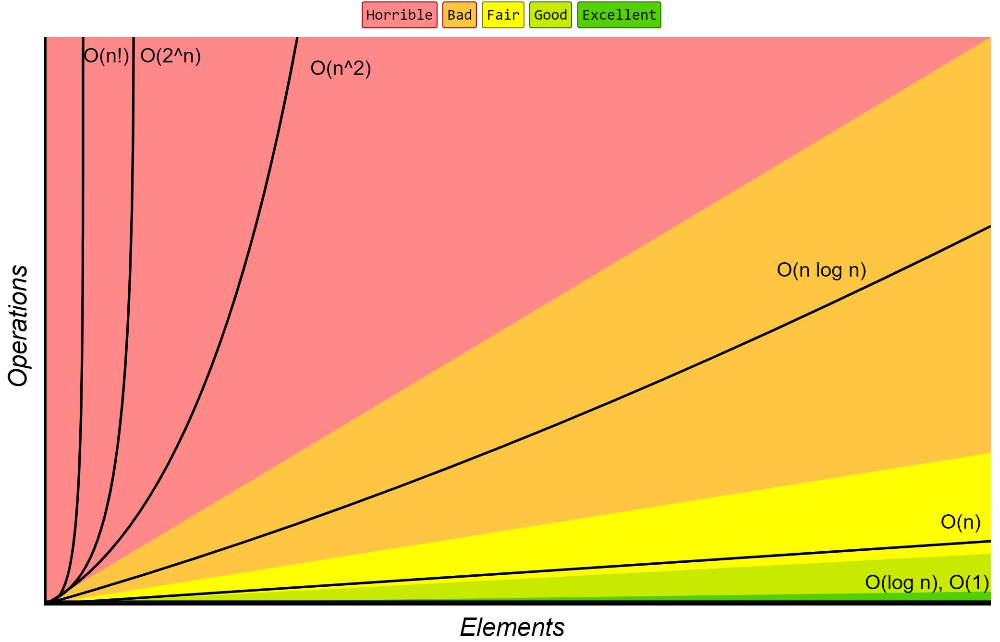

<!-- theme: default -->
<!-- paginate: true -->
<!-- footer: Copyright (c) by **Bogdan Mihai Nicolae** | Licensed under MIT -->

# Play with Trivia Refactoring Kata

###### by Bogdan Mihai Nicolae

---
## 🗂️ Agenda

- The problem
- Some Data Structures
- Some Principles
- Conclusion
- Further Reading & Watching

---

## 🚨 The problem 


- Clone Victor Rentea's [kata-trivia-java](https://github.com/webtoknow/kata-trivia-java) repository to get started on your local machine! 🖥️
  ```bash
    git clone https://github.com/webtoknow/kata-trivia-java.git
    cd kata-trivia-java
    ``` 
- **Our mission**: Refactor Game.java ⚙️, but keep an eye on the GameTest 🧪 to make sure nothing breaks! 💥

---

## 📏 Fixed sized arrays Java (static)

```java
    private String[] players = new String[6];
    private int[] places = new int[6];
    private int[] purses = new int[6];
    private boolean[] inPenaltyBox = new boolean[6];
```

## 📚 Learn More:
Take a look at [Why do some arrays in some languages have a fixed size, like in Java?](https://www.quora.com/Why-do-some-arrays-in-some-languages-have-a-fixed-size-like-in-Java)

---

## 📱 Array In javascript (dynamic)

 - In JavaScript, arrays are dynamic! 🚀 They grow and shrink like magic! 🎩✨
 - When your array gets too full, don't worry—it doubles in size! 💪

```javascript
    let players = [];
    players.push("John");
    players.push("Doe");
    players.push("Jane");
```

## 📚 Learn More:
Explore this topic: [Static vs Dynamic Arrays in JavaScript](https://medium.com/@rodriguezlf4/static-vs-dynamic-arrays-javascript-beauty-f226e153cbc9)

---

## 🔒 Fixed sized arrays in JavaScript

```javascript
let a = new Array(42);

if(Object.seal) {
  // fill array with some value because
  // empty slots can not be changed after calling Object.seal
  a.fill(undefined);

  Object.seal(a);
  // now a is a fixed-size array with mutable entries
}
```

## 📚 Learn More:
Check out this discussion: [Is it possible to create a fixed length array in javascript](https://stackoverflow.com/questions/21988909/is-it-possible-to-create-a-fixed-length-array-in-javascript)

---

## 🔗 LinkedList in JavaScript

```Javascript
class LinkedList {
  constructor() {
    this.head = null;
    this.size = 0;
  }

  insert(data) {
    const newNode = { data, next: null };
    if (!this.head) this.head = newNode;
    else {
      let current = this.head;
      while (current.next) current = current.next;
      current.next = newNode;
    }
    this.size++;
  }
}
```

---

## 📊 Big O Complexity



## 📚 Learn More:
The cheat sheet for algorithmic complexity: [Big O Cheat Sheet](https://www.bigocheatsheet.com/)

---

## 💡 Missing Types in the Codebase
Working without proper types can lead to runtime errors, hard-to-read code, and slower development cycles. Adding types ensures your code is robust and developer-friendly. 🛡️

### 🏆 Key Benefits:
- **Improves reliability**: Catch errors before runtime. ✅
- **Enhances developer experience**: Better autocompletion and IDE support. 🖥️
- **Simplifies maintenance**: Types act as living documentation for your code. 📜

---


## 💡 The DRY Principle
"Don't Repeat Yourself" ensures every piece of knowledge in your system has a single, definitive source.


### 🏆 Key Benefits:
- **Easier maintenance**: Fix a bug once and you're done! 🔍
- **Consistency guaranteed**: Fewer changes = fewer errors. ✅
- **Clean and scalable**: Your code stays readable and ready to grow. 🚀

---

## 🔑 Single-Responsibility Principle (SRP) - The S in SOLID
Every class, module, or function should have a single responsibility—focus on doing one thing well! 🎯

### 🏆 Key Benefits:
- **Improved readability**: Clearer, more focused code. 👀
- **Easier debugging and testing**: Fewer responsibilities = fewer bugs. 🐛
- **Enhanced maintainability**: Isolated changes don’t ripple through the system. 🌊

---


## 💋 The KISS Principle
"Keep It Simple, Stupid" (KISS), the goal is to keep systems as simple as possible—no overcomplicating things! 🎯

### 🏆 Key Benefits:
- **Easier to debug and maintain**: Less code means less chaos when things go wrong! 🛠️
- **Faster onboarding for new developers**: Simplicity = less confusion, more learning! 📚
- **Reduced risk of errors**: Fewer moving parts = fewer chances for mistakes! ⚡

---

## 📏 Flatten Functions
Flattening functions means simplifying them by breaking down complex, nested structures into smaller, more manageable pieces. 🧩
Keep each function short, clear, and focused on a single task. 🎯

🏆 Key Benefits:
- **Improved readability**: Easier for others (and future you!) to understand. 👀
- **Simpler debugging**: Smaller functions are easier to test and fix. 🐞
- **Better reusability**: Clean, standalone functions can be used elsewhere. 🔄

---

## 🎉 Conclusion
- Refactoring is key 🔧: Enhancing maintainability, readability, and performance 🚀.
- Principles applied:
  - **SOLID** 🧱: Cleaner, modular design with a focus on single responsibility 🎯.
  - **DRY** 🚫🔁: Eliminated redundancy for better code reuse 🔄 and simpler maintenance 🛠️.
  - **KISS** 😎✂️: Streamlined the game logic to avoid unnecessary complexity 🧩.
  - **Big O Complexity** 📊: Optimized for better performance and scalability 📈.
- Final goal 🎯: Ensure a more robust 💪 and flexible game structure that can easily accommodate new features 🌱 and growth 🌍.

---
## 📚 Further Reading & Watching

- Books 📚:
  - [Clean Code: A Handbook of Agile Software Craftsmanship](https://www.amazon.com/Clean-Code-Handbook-Software-Craftsmanship/dp/0132350882)
  - [Refactoring: Improving the Design of Existing Code](https://www.amazon.com/Refactoring-Improving-Existing-Addison-Wesley-Signature/dp/0134757599)

- Video 🎥:
  - [Clean Code: The Next Chapter by Victor Rentea](https://www.youtube.com/watch?v=wY_CUkU1zfw&t=5871s) 
  - [Live-Refactoring a realistic codebase](https://www.youtube.com/watch?v=soRiS4dNED4&t=436s)
  - [Clean Code - Uncle Bob / Lesson 1](https://www.youtube.com/watch?v=7EmboKQH8lM)